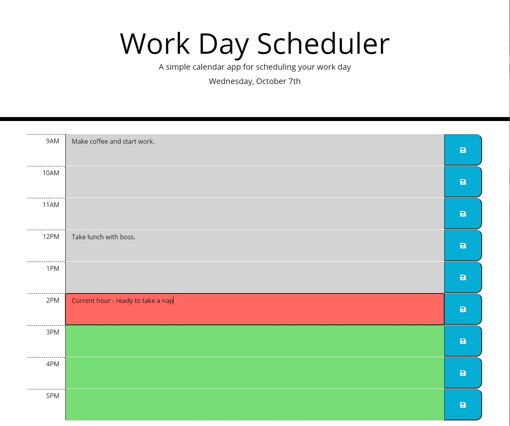

# Daily Planner

## Description

This application allows user to create a daily work day scheduler for scheduling activities/events during typical work hours (9AM - 5PM). The application keeps track of activities for each hour and color codes the hours based on the current hour of the day. The application will also display the day and date at the top for user reference.

The time-blocks are dynamically generated using jQuery, HTML, and CSS. The date and time is retrieved with the [Moment.js](https://momentjs.com/) library. Each time block time value is generated with the Moment.js library.

## Table of Contents

- [Description](#description)
- [User Story](#user-story)
- [Acceptance Criteria](#acceptance-criteria)
- [Installation](#installation)
- [Application Screenshot](#application-screenshot)
- [Usage](#usage)
- [Credits](#credits)

## User Story

```
AS AN employee with a busy schedule
I WANT to add important events to a daily planner
SO THAT I can manage my time effectively
```

## Acceptance Criteria

```
GIVEN I am using a daily planner to create a schedule
WHEN I open the planner
THEN the current day is displayed at the top of the calendar
WHEN I scroll down
THEN I am presented with time blocks for standard business hours
WHEN I view the time blocks for that day
THEN each time block is color-coded to indicate whether it is in the past, present, or future
WHEN I click into a time block
THEN I can enter an event
WHEN I click the save button for that time block
THEN the text for that event is saved in local storage
WHEN I refresh the page
THEN the saved events persist
```

## Installation

No installation is required for this application. The Daily Planner can be viewed at [Daily Planner](https://ntch2000.github.io/daily-planner/).

To see the code used to create the planner, please visit the Github repository at the [Github Repo](https://github.com/ntch2000/daily-planner).

## Application Screenshot


_Application Screenshot of main time-blocks with current hour highlighted red_

## Usage

To utilize the application, users can enter any information into the time blocks and click the save button. This will save the information entered for that specific time block into local storage. Additional information can be entered into the other time block and saved with the corresponding buttons. This information will persist as the page is reloaded.

Information can also be edited/changed and saved again, which will rewrite the information in local storage. When the page is reloaded, the current hour block will be highlighted red to notify the user of current hour in the local time zone. Hours that have past will be colored grey while hours in the future will be colored green.

## Credits

- [Moment.js](https://momentjs.com/) was used throughout this project to get the proper time in order to dynamically generate the html time blocks as well as check the current date and hour.

---

© 2020 Neil Gandhi
